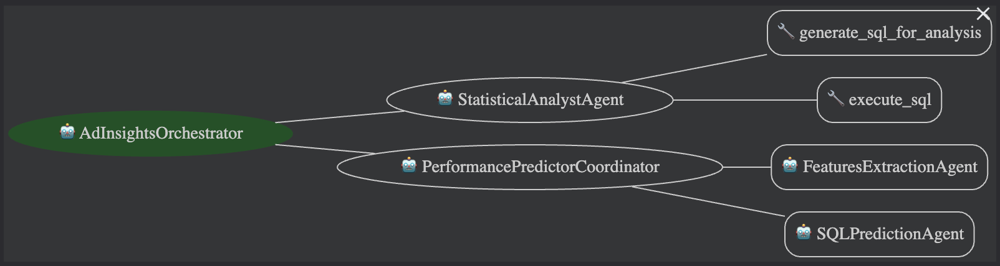

# Overview

Brands constantly ask questions like:  

- **Did ads with logos perform better?**  
- **Which creative elements historically gave us the biggest lift?**  
- **Can you predict how this new image or video will perform before publishing it?**

Answering these questions across dozens of brands and thousands of ads is slow, repetitive, and resource-intensive. Data analysts must manually write SQL, run statistical analysis, validate creative tags, clean results, and prepare insights. Meanwhile, clients wait days for answers—delaying decisions and increasing marketing costs.

---

## Solution: Multi-Agent Creative Analytics System

To solve this real-world problem, I built a **Multi-Agent Creative Analytics System** using **Google ADK**, designed to let brands get **accurate insights instantly** without depending on analysts.

### Key Agents:

- **Orchestrator Agent**: Understands user intent and routes tasks to the right specialist agent.  
- **Statistical Analysis Agent**: Examines historical performance using SQL to answer *“What worked before?”*  
- **Performance Prediction Agent**: Analyzes new creatives using multi-modal LLMs and BigQuery ML to predict *“What will work next?”*  

Together, they automate **end-to-end creative intelligence**, empowering brands to act quickly and confidently.

---

## Why This Matters

This system gives brands a **front-row seat** to their creative performance:

- Analyze creative performance **anytime**  
- Predict outcomes **before running ads**  
- Make **strategic decisions in seconds**  
- Save **time, effort, and significant marketing spend**  

For analytics teams, it removes repetitive SQL tasks and frees them to focus on **high-value insights**.

---

## Real-World Impact

- Faster answers to creative questions  
- No more manual SQL or long turnaround times  
- Scalable intelligence across many brands  
- Improved marketing efficiency and reduced ad-spend waste  

In short, this **multi-agent system transforms how brands understand and optimize their creative performance.**

# Architecture

The diagram below illustrates the flow and interaction between agents in the Multi-Agent Creative Analytics System:

**Explanation:**

1. **Orchestrator Agent**  
   - Receives user queries and delegates tasks to the right specialist agent.
2. **Statistical Analysis Agent**  
   - Handles historical performance queries via SQL and BigQuery database.
3. **Performance Prediction Agent**  
   - Processes new creative assets (images/videos) using multimodal LLM and hosted BigQuery ML model to forecast performance.
4. **Workflow**  
   - The orchestrator ensures the right agent handles each query.
   - Outputs are collected and returned to the user in a simplified format.
